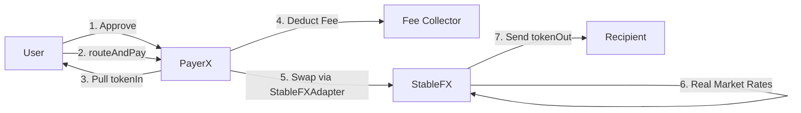

# PayerX - ARC Smart Payment Router

A **production-ready**, non-custodial Smart Payment Router for the **ARC Layer-1 blockchain** by Circle. PayerX enables atomic cross-stablecoin payments with advanced features like fee collection, emergency pause, and token whitelisting.

## 🌟 Overview

PayerX allows senders to pay using one stablecoin (e.g., EURC) while recipients receive another (e.g., USDC) in a single, atomic transaction. Built specifically for the ARC blockchain, which uses USDC as native gas and features built-in FX capabilities.

### ✨ Key Features

✅ **Atomic Cross-Stablecoin Payments** - Complete payment routing in a single transaction  
✅ **Slippage Protection** - Mandatory `minAmountOut` parameter protects users  
✅ **Non-Custodial Design** - Contract never holds user funds after transactions  
✅ **Emergency Pause** - Owner can pause/unpause contract in emergencies  
✅ **Fee Collection System** - Optional fee (max 1%) with configurable collector  
✅ **Token Whitelist** - Optional security layer to restrict supported tokens  
✅ **Generic FX Integration** - Works with StableFX, Uniswap, or any DEX  
✅ **ReentrancyGuard** - Protection against reentrancy attacks  
✅ **Gas Efficient** - Optimized for ARC's $0.01 per transaction target  

## 🏗️ Architecture

### Core Components

1. **PayerX.sol** - Main router contract (2.07M gas deployment)
2. **StableFXAdapter.sol** - Adapter for Circle's StableFX with real market rates
3. **MockFXEngine.sol** - Test FX engine for local development
4. **IFXEngine.sol** - Generic interface for FX engines
5. **IERC20.sol** - Standard ERC20 token interface
6. **IPermit2.sol** - Interface for Uniswap Permit2 (StableFX compatibility)

### Payment Flow



All steps execute atomically - if any step fails, the entire transaction reverts.

### FX Engine Options

| Engine | Type | Rates | Use Case |
|--------|------|-------|----------|
| **StableFXAdapter** | Production | Real-time market | Mainnet & testnet (recommended) |
| **MockFXEngine** | Test | Hardcoded | Local development only |
| **StableFX Direct** | Production | RFQ-based | Advanced institutional use |

## 📡 ARC Network Information

### ARC Testnet
- **Chain ID**: 5042002
- **RPC Endpoint**: `https://rpc.testnet.arc.network`
- **Native Gas Token**: USDC (18 decimals for gas, 6 decimals for ERC-20)
- **Block Explorer**: https://testnet.arcscan.app
- **Faucet**: https://faucet.circle.com
- **Target Gas Fee**: ~$0.01 per transaction (160 Gwei minimum)

### Official Contract Addresses

| Contract | Address | Description |
|----------|---------|-------------|
| **USDC** | `0x3600000000000000000000000000000000000000` | Native gas token (ERC-20 interface, 6 decimals) |
| **EURC** | `0x89B50855Aa3bE2F677cD6303Cec089B5F319D72a` | Euro stablecoin (6 decimals) |
| **USYC** | `0xe9185F0c5F296Ed1797AaE4238D26CCaBEadb86C` | Yield-bearing token (6 decimals) |
| **StableFX Escrow** | `0x1f91886C7028986aD885ffCee0e40b75C9cd5aC1` | Institutional FX engine |
| **Permit2** | `0x000000000022D473030F116dDEE9F6B43aC78BA3` | Allowance management |

## 📝 Smart Contract API

### Constructor

```solidity
constructor(
    address _fxEngine,
    address _feeCollector,
    uint256 _feeBps
)
```

**Parameters:**
- `_fxEngine` - Address of FX Engine (StableFX, Uniswap, etc.)
- `_feeCollector` - Address that receives collected fees
- `_feeBps` - Fee in basis points (10 = 0.1%, max 100 = 1%)

### routeAndPay

```solidity
function routeAndPay(
    address tokenIn,
    address tokenOut,
    uint256 amountIn,
    uint256 minAmountOut,
    address recipient
) external returns (uint256 amountOut)
```

**Parameters:**
- `tokenIn` - Address of input stablecoin (sender pays with this)
- `tokenOut` - Address of output stablecoin (recipient receives this)
- `amountIn` - Amount of input tokens to send
- `minAmountOut` - Minimum acceptable output (slippage protection)
- `recipient` - Address that will receive output tokens

**Requirements:**
- Contract must not be paused
- Tokens must be whitelisted (if whitelist is enabled)
- Sender must approve PayerX for at least `amountIn`
- All addresses must be non-zero
- `amountIn` must be greater than zero

### Admin Functions

#### updateFee
```solidity
function updateFee(uint256 _feeBps) external onlyOwner
```
Update the fee percentage (max 1%).

#### updateFeeCollector
```solidity
function updateFeeCollector(address _feeCollector) external onlyOwner
```
Change the address that receives collected fees.

#### setTokenWhitelist
```solidity
function setTokenWhitelist(address token, bool status) external onlyOwner
```
Add or remove a token from the whitelist.

#### batchSetTokenWhitelist
```solidity
function batchSetTokenWhitelist(address[] calldata tokens, bool status) external onlyOwner
```
Batch whitelist/delist multiple tokens at once.

#### setWhitelistEnabled
```solidity
function setWhitelistEnabled(bool enabled) external onlyOwner
```
Enable or disable whitelist enforcement.

#### pause / unpause
```solidity
function pause() external onlyOwner
function unpause() external onlyOwner
```
Emergency pause/unpause the contract.

### getEstimatedOutput

```solidity
function getEstimatedOutput(
    address tokenIn,
    address tokenOut,
    uint256 amountIn
) external view returns (uint256 estimatedAmountOut)
```

Get estimated output amount before executing a payment.

### updateFXEngine (Owner Only)

```solidity
function updateFXEngine(address _fxEngine) external onlyOwner
```

Update the FX Engine address. Only callable by contract owner.

## 🧪 Testing

The project includes comprehensive test coverage with **23 test cases** covering:

- ✅ Contract deployment and initialization
- ✅ Full payment flow (EURC → USDC and reverse)
- ✅ Fee collection and calculation
- ✅ Slippage protection enforcement
- ✅ Input validation and error handling
- ✅ Non-custodial guarantee (no fund accumulation)
- ✅ Atomic transaction behavior
- ✅ Owner function access control

### Run Tests

```bash
npx hardhat test
```

### Test Results

```
✔ 23 passing (848ms)

Gas Usage:
- routeAndPay: 130k - 158k gas (avg: 148k)
- Deploy PayerX: ~2.07M gas
- updateFXEngine: ~31k gas
```

## 🚀 Deployment Guide

### Prerequisites

1. **Install Dependencies**
```bash
npm install --legacy-peer-deps
```

2. **Setup Environment**
```bash
cp .env.example .env
# Edit .env and add your PRIVATE_KEY
```

3. **Get Testnet USDC for Gas**
- Visit https://faucet.circle.com
- Select "Arc Testnet"
- Request USDC (needed for gas fees)

4. **Get Test Tokens** (for testing payments)
- Request USDC, EURC, USYC from faucet
- These are REAL ARC Testnet tokens (official Circle deployments)

### Deploy to ARC Testnet

#### Option A: Quick Start (Test with Mock Rates)

```bash
# Step 1: Deploy contracts (PayerX + MockFXEngine)
node scripts/deploy-arc.js

# Step 2: Fund MockFXEngine with REAL tokens (after getting from faucet)
node scripts/fund-fxengine.js

# Step 3: Test a real payment
node scripts/test-payment.js
```

#### Option B: Production Setup (Real Market Rates)

```bash
# Step 1: Deploy PayerX with MockFXEngine (initial)
node scripts/deploy-arc.js

# Step 2: Deploy StableFXAdapter for real rates
node scripts/deploy-stablefx-adapter.js

# Step 3: Fund adapter with liquidity
node scripts/fund-adapter.js

# Step 4: Migrate PayerX to use real rates
node scripts/migrate-to-stablefx.js

# Step 5: Test with real market rates
node scripts/test-stablefx-payment.js
```

See [MIGRATION_GUIDE.md](./MIGRATION_GUIDE.md) for detailed migration steps.

### What Gets Deployed

**Quick Start (Mock):**
- ✅ PayerX Contract (main router)
- ✅ MockFXEngine (hardcoded rates: 1 EURC = 1.1 USDC)

**Production (Real Rates):**
- ✅ PayerX Contract (main router)
- ✅ StableFXAdapter (real market rates: 1 EURC = 1.09 USDC)
- ✅ Integration with Circle's StableFX

**Important**: These are official Circle stablecoins on ARC Testnet:
- USDC: `0x3600000000000000000000000000000000000000`
- EURC: `0x89B50855Aa3bE2F677cD6303Cec089B5F319D72a`
- USYC: `0xe9185F0c5F296Ed1797AaE4238D26CCaBEadb86C`

### Deployment Output

The script will:
1. ✅ Deploy MockFXEngine with configurable exchange rates
2. ✅ Deploy PayerX with your fee configuration
3. ✅ Setup token whitelist (all 3 ARC stablecoins)
4. ✅ Save deployment info to `deployments/arc-testnet.json`

### Manual Deployment Steps

If you prefer manual deployment:

```bash
# 1. Compile contracts
npx hardhat compile

# 2. Deploy via Hardhat console
npx hardhat console --network arc-testnet

# 3. In console:
const PayerX = await ethers.getContractFactory("PayerX");
const payerX = await PayerX.deploy(
  "0xYourFXEngineAddress",
  "0xYourFeeCollector",
  10  // 0.1% fee
);
await payerX.waitForDeployment();
console.log("PayerX deployed to:", await payerX.getAddress());
```

## 📦 Project Structure

```
PayerX_Router/
├── contracts/
│   ├── PayerX.sol              # Main router (enhanced v2)
│   ├── IERC20.sol              # ERC20 interface
│   ├── IFXEngine.sol           # Generic FX engine interface
│   ├── IPermit2.sol            # Permit2 interface (StableFX)
│   └── mocks/
│       ├── MockERC20.sol       # Test stablecoin
│       └── MockFXEngine.sol    # Test FX engine
├── scripts/
│   └── deploy-arc.js           # ARC Testnet deployment
├── test/
│   └── PayerX.js               # Comprehensive test suite (23 tests)
├── deployments/                # Deployment artifacts
├── hardhat.config.js           # Main config
├── hardhat.config.arc.js       # ARC-specific config
├── .env.example                # Environment template
└── README.md
```

## Installation

```bash
# Clone repository
git clone <your-repo-url>
cd PayerX_Router

# Install dependencies
npm install --legacy-peer-deps

# Setup environment
cp .env.example .env
# Edit .env with your configuration

# Compile contracts
npx hardhat compile

# Run tests
npx hardhat test

# Deploy to ARC Testnet
npx hardhat run scripts/deploy-arc.js --network arc-testnet
```

## 🔧 Configuration

### Environment Variables (.env)

```bash
# Wallet & Network
PRIVATE_KEY=your_private_key_here
ARC_TESTNET_RPC_URL=https://rpc.testnet.arc.network

# Deployment Config
FEE_BPS=10                    # 0.1% fee
FEE_COLLECTOR=0xYourAddress   # Fee recipient

# Optional
REPORT_GAS=false
FORKING=false
```

### Fee Configuration

- **Default**: 10 basis points (0.1%)
- **Maximum**: 100 basis points (1%)
- **Formula**: `feeAmount = (amountIn × feeBps) / 10000`

### Whitelist Configuration

By default, whitelist is **disabled** (flexible mode). To enable:

```solidity
// Enable whitelist
await payerX.setWhitelistEnabled(true);

// Add tokens to whitelist
await payerX.batchSetTokenWhitelist(
  ["0xUSDC", "0xEURC", "0xUSDT"],
  true
);
```

## 💡 Usage Examples

### Basic Payment

```javascript
const { ethers } = require("ethers");

// Setup
const payerX = await ethers.getContractAt("PayerX", PAYERX_ADDRESS);
const eurc = await ethers.getContractAt("IERC20", EURC_ADDRESS);

// 1. Approve PayerX
const amount = ethers.parseUnits("1000", 6); // 1000 EURC
await eurc.approve(PAYERX_ADDRESS, amount);

// 2. Get estimated output
const estimated = await payerX.getEstimatedOutput(
  EURC_ADDRESS,
  USDC_ADDRESS,
  amount
);

// 3. Execute payment with 1% slippage tolerance
const minOut = (estimated * 99n) / 100n;
await payerX.routeAndPay(
  EURC_ADDRESS,
  USDC_ADDRESS,
  amount,
  minOut,
  RECIPIENT_ADDRESS
);
```

### Admin Operations

```javascript
// Update fee to 0.2%
await payerX.updateFee(20);

// Change fee collector
await payerX.updateFeeCollector(NEW_COLLECTOR);

// Emergency pause
await payerX.pause();

// Resume operations
await payerX.unpause();

// Update FX Engine
await payerX.updateFXEngine(NEW_FX_ENGINE);
```

## Dependencies

- **Solidity**: ^0.8.20
- **Hardhat**: ^2.26.0
- **OpenZeppelin Contracts**: ^5.4.0 (Ownable, Pausable, ReentrancyGuard)
- **Ethers.js**: ^6.x
- **Chai**: ^4.x (for testing)

## 🔒 Security Features

1. **Slippage Protection** - Every swap enforces minimum output amount
2. **Input Validation** - All parameters validated before execution
3. **Non-Custodial** - Contract never holds user funds after transactions
4. **Atomic Execution** - All-or-nothing transaction semantics
5. **Access Control** - Critical functions protected with `onlyOwner`
6. **Emergency Pause** - Owner can pause contract in emergencies
7. **ReentrancyGuard** - Protection against reentrancy attacks
8. **Fee Cap** - Maximum 1% fee enforced at contract level
9. **Token Whitelist** - Optional security layer for token restrictions

### Audit Status

⚠️ **Not yet audited** - This is a testnet/development version. Do not use in production without proper security audit.

## 🎯 Production Considerations

Before mainnet deployment:

1. ✅ **Security Audit** - Engage professional auditors
2. ✅ **FX Engine Integration** - Replace mock with real StableFX or DEX
3. ✅ **Permit2 Support** - Implement gasless approvals (if using StableFX)
4. ✅ **Multi-sig Ownership** - Use multi-sig wallet for owner functions
5. ✅ **Rate Limiting** - Consider adding per-user limits
6. ✅ **Monitoring** - Setup event monitoring and alerts
7. ✅ **Insurance** - Consider insurance/safety modules

## 🚀 Advanced Features Roadmap

- [ ] Multi-hop routing for better rates
- [ ] Batch payment support (multiple recipients)
- [ ] CCTP integration for cross-chain payments
- [ ] Time-weighted average price (TWAP) integration
- [ ] Permit2 native support (gasless approvals)
- [ ] Advanced slippage calculation algorithms
- [ ] Payment scheduling/recurring payments
- [ ] Referral/affiliate system

## 🤝 Integration with StableFX

PayerX is designed to work with ARC's native StableFX engine. To integrate:

### Option 1: Direct Integration (Recommended for Production)

Replace `MockFXEngine` with actual StableFX contract:

```solidity
// Deploy PayerX with StableFX Escrow
const payerX = await PayerX.deploy(
  "0x1f91886C7028986aD885ffCee0e40b75C9cd5aC1", // StableFX Escrow
  feeCollector,
  feeBps
);
```

### Option 2: Adapter Pattern

Create an adapter contract that implements `IFXEngine` and wraps StableFX's RFQ flow:

```solidity
contract StableFXAdapter is IFXEngine {
    IStableFX public stableFX;
    
    function swap(...) external override returns (uint256) {
        // Implement RFQ flow with StableFX
        // Handle Permit2 approvals
        // Return actual amount received
    }
}
```

## 📊 Gas Optimization

PayerX is optimized for ARC's ~$0.01 target transaction cost:

| Operation | Gas Usage | Cost @ 160 Gwei | Notes |
|-----------|-----------|-----------------|-------|
| Deploy PayerX | 2,074,444 | One-time | Includes all features |
| routeAndPay | 130k - 158k | ~$0.01 | Depends on token transfers |
| updateFee | 31,014 | <$0.01 | Admin function |
| pause/unpause | ~23k | <$0.01 | Emergency function |

## 🐛 Troubleshooting

### Common Issues

**1. "Insufficient USDC for gas fees"**
```bash
# Solution: Get testnet USDC from faucet
Visit: https://faucet.circle.com
Select: Arc Testnet
Request: USDC (used for gas on ARC)
```

**2. "PayerX: tokenIn not whitelisted"**
```bash
# Solution: Disable whitelist or add token
await payerX.setWhitelistEnabled(false);
# OR
await payerX.setTokenWhitelist(tokenAddress, true);
```

**3. "Slippage tolerance exceeded"**
```bash
# Solution: Increase minAmountOut tolerance
const minOut = (estimatedAmount * 95n) / 100n; // 5% slippage
```

**4. "Contract is paused"**
```bash
# Solution: Unpause contract (owner only)
await payerX.unpause();
```

## 📚 Additional Resources

- **ARC Network Docs**: https://docs.arc.network
- **StableFX Docs**: https://developers.circle.com/stablefx
- **ARC Explorer**: https://testnet.arcscan.app
- **Circle Faucet**: https://faucet.circle.com
- **Permit2 Docs**: https://docs.uniswap.org/contracts/permit2/overview

## 🙏 Acknowledgments

Built on ARC Network by Circle with:
- OpenZeppelin secure contract libraries
- Hardhat development environment
- Uniswap Permit2 standard

## License

MIT

## Contact

Built for the ARC Layer-1 blockchain by Circle.
